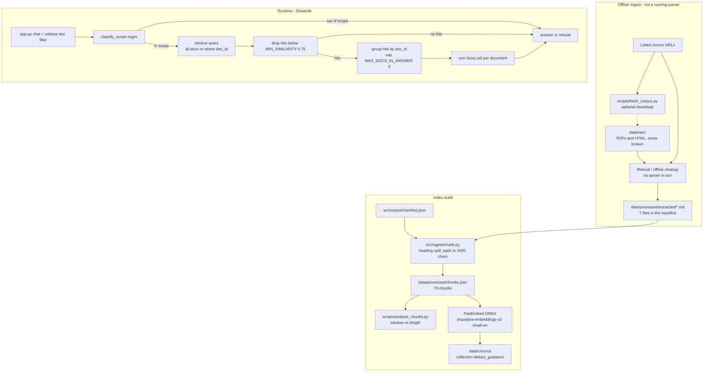

# Architecture

What is actually built, as of the code and data in this repository. This is not a design proposal.

## What the system is

A Streamlit chat app that answers food, nutrition, and food safety questions from seven official guidance documents stored in a persistent ChromaDB collection. Generation is Groq `openai/gpt-oss-120b`. Two refusals run in Python before or instead of generation: out-of-scope (regex) and not-in-corpus (similarity floor).

The live corpus is **seven cleaned markdown files** listed in `src/corpus/manifest.json`. It is not the mixed `data/raw/` folder. There is no HTML or PDF parser in `src/`.

## End-to-end flow

## Ingestion pipeline

The wired path is:

1. `src/corpus/manifest.json` lists seven documents and the extracted markdown filename for each.
2. `scripts/build_chunks.py` calls `src.ingest.chunk.build_chunks()`, which reads those markdown files from `data/processed/extracted/` and writes `data/processed/chunks.json`.
3. `scripts/analyze_chunks.py` measures character and estimated-token lengths and records the embedding choice in `data/processed/chunk_analysis.json`.
4. `scripts/build_index.py` calls `src.retrieve.index.build_index()`, which deletes and recreates the Chroma collection `dietary_guidance` under `data/chroma`.

`scripts/fetch_corpus.py` is a download helper only. It GETs each `source_url` and writes `data/raw/{doc_id}.pdf` or `{doc_id}.html`. It does not parse, does not write markdown, and is not called by chunking or indexing. Its destination names do not match the files that are actually in `data/raw/`. There is no `data/raw/provenance.json` on disk, so a successful run of this script is not checked in.

| Step | Script / module | Input | Output |
| --- | --- | --- | --- |
| Download (optional, unused by later steps) | `scripts/fetch_corpus.py` | `manifest.json` URLs | intended `data/raw/{doc_id}.{pdf,html}` |
| Parse HTML / PDF | **none in repo** | — | — |
| Chunk | `scripts/build_chunks.py` → `src/ingest/chunk.py` | 7 `*.md` files | `data/processed/chunks.json` |
| Analyse | `scripts/analyze_chunks.py` | `chunks.json` | `data/processed/chunk_analysis.json` |
| Embed + store | `scripts/build_index.py` → `src/retrieve/index.py` | `chunks.json` | `data/chroma` |

## Parsing for HTML and PDF

There is no parser. `src/ingest/` contains only `chunk.py`. `requirements-dev.txt` lists `pymupdf`, `beautifulsoup4`, `lxml`, and `httpx`, but no project script imports them except `httpx` in `fetch_corpus.py`.

What exists instead:

- Two leftover page-dump text files (`icmr_nin_my_plate_2024.txt`, `eatwell_quick_guide.txt`) look like `pdftotext`-style output. They are **not** in the manifest and are not read by the chunker.
- The seven `*.md` files that *are* in the manifest are heading-structured, chrome-stripped prose. Someone cleaned them offline.

Raw files on disk, versus what the chunker uses:

| Manifest `doc_id` | Format claimed | What is in `data/raw/` | Wired into the index? |
| --- | --- | --- | --- |
| `icmr_nin_my_plate` | pdf | Real 4-page PDF (`icmr_nin_my_plate_2024.pdf`) | No. Index uses `icmr_nin_my_plate.md` |
| `sfa_reusing_cooking_oils` | html | Real SFA HTML (`sfa_reusing_oils.html`) | No. Index uses `sfa_reusing_cooking_oils.md` |
| `who_healthy_diet` | html | Real WHO HTML (`who_healthy_diet.html`) | No. Index uses `who_healthy_diet.md` |
| `who_sfa_tfa_guideline` | pdf_summary | Two HTML error pages saved with `.pdf` names (reCAPTCHA / DSpace shell) | No. Index uses `who_sfa_tfa_guideline.md` |
| `eatwell_guide` | pdf | Real Quick Guide PDF (`eatwell_quick_guide.pdf`) | No. Index uses `eatwell_guide.md` |
| `health_canada_recommendations` | html | HTML “Page Moved Permanently” saved as `hc_dietary_guidelines.pdf` | No. Index uses `health_canada_recommendations.md` |
| `foodsafety_cold_storage` | html | Akamai “Access Denied” page | No. Index uses `foodsafety_cold_storage.md` |

`fetch_corpus.py` treats any format other than `"pdf"` as HTML, so `pdf_summary` would be saved as `.html`. That path is unused.

## Chunking strategy and why

Implemented in `src/ingest/chunk.py`.

1. **Split on markdown headings.** `split_sections` walks `#`–`######` lines and yields `(heading, body)` pairs. Body before the first heading is filed under `"Document"`.
2. **Break each body into atomic units.** A markdown table (`|` rows) or a run of numbered items (`^\s*\d+\.\s+\S`) is one **protected** unit. Other text is packed as paragraphs. A bullet list after prose starts a new unprotected unit.
3. **Pack unprotected units** toward `TARGET_CHUNK_CHARS = 1600`. Flush before every protected unit. Ordinary prose longer than `MAX_CHUNK_CHARS = 2400` is split only on blank lines (`_split_long_prose`). Protected units are appended whole and are never passed to that splitter.
4. **Fold leftovers under 40 characters** into the next same-document, non-protected chunk (`_merge_tiny_chunks`) so orphan dates and headings do not become their own vectors.

Why this shape: the brief forbids cutting tables or numbered recommendations in half. The ICMR plate table and each FoodSafety.gov food-category table stay one chunk. The WHO SFA recommendation list (items 1–3) and the TFA list (items 1–3) each stay one chunk. The cost, recorded in `data/processed/chunk_analysis.json` and the README, is 76 chunks instead of a coarser ~50, plus some short but complete sections.

Each chunk carries `chunk_id`, `doc_id`, `document_name`, `publisher`, `year`, `source_url`, `retrieval_date`, `section_heading`, `text`, `protected`, `char_count`.

Current counts from `chunks.json`: 76 total, 16 protected. Per document: WHO Healthy diet 15, Eatwell 15, FoodSafety 14, WHO SFA/TFA 12, ICMR 10, Health Canada 7, SFA oils 3.

## Embedding model

Chosen after `scripts/analyze_chunks.py`, not before chunking.

| Model | Window | Decision in `chunk_analysis.json` |
| --- | --- | --- |
| `all-MiniLM-L6-v2` | 256 tokens | Rejected. Would truncate 18 chunks. |
| `BAAI/bge-small-en-v1.5` | 512 tokens | Rejected. Would truncate 3 chunks, including the WHO SFA/TFA Background section. |
| `snowflake-arctic-embed-m-long` | 2,048 tokens | Rejected. 0.54 GB ONNX and needs a query prefix. |
| `nomic-embed-text-v1.5` | 8,192 tokens | Rejected. Needs passage and query prefixes, heavier to host. |
| `jinaai/jina-embeddings-v2-small-en` | 8,192 tokens | Chosen. Max estimated chunk is 893 tokens. 33M params, 512-d, 0.12 GB ONNX. |

Serving is FastEmbed (ONNX) via `FastEmbedEmbeddingFunction` in `src/retrieve/index.py`. Neither queries nor passages get a prefix (`EMBEDDING_QUERY_PREFIX = ""`). Default model name is `src.config.EMBEDDING_MODEL`.

Token estimates in the analysis script are a whitespace heuristic (`words / 0.75`), not a real tokenizer.

## ChromaDB layout

- Client: `chromadb.PersistentClient(path=data/chroma)`
- Collection name: `dietary_guidance` (`src.config.COLLECTION_NAME`)
- Space: cosine (`metadata={"hnsw:space": "cosine"}`)
- Records: 76 embeddings (one per chunk)
- Id: `chunk_id` (for example `icmr_nin_my_plate-006`)
- Document field: chunk `text`
- Metadata keys: `doc_id`, `document_name`, `publisher`, `year`, `source_url`, `retrieval_date`, `section_heading`, `protected`
- On disk: `chroma.sqlite3` plus one HNSW folder, `6181f694-7c53-427e-b292-2741488a3614/` (the collection's vector segment)

`build_index` deletes the collection if it exists, then `get_or_create_collection` and `add`. Runtime reads use `get_or_create_collection` with the same embedding function (`get_collection`, cached).

## Retrieval

`src.retrieve.index.retrieve(query, doc_id=None, top_k=TOP_K)`:

- Calls `collection.query` over every chunk matching the filter with `include=["documents", "metadatas", "distances"]`.
- **All documents:** `where` is `None`.
- **One document:** `where={"doc_id": doc_id}`.
- Converts cosine distance to `similarity = 1.0 - distance`.
- Drops hits below `MIN_SIMILARITY` (default `0.75`).
- Per document, keeps at most `PER_DOC_CHUNK_CAP` (3) chunks within `PER_DOC_WINDOW` (0.04) of that document's best hit, then the top `TOP_K` overall.
- `enough` is true iff at least one hit remains.
- `searched_documents` is the full manifest catalog, or the one matching `doc_id`. This list is what the not-in-corpus refusal names.

Defaults: `TOP_K=10`. The Streamlit sidebar maps `"all"` to `doc_id=None` and any other key to that document’s `doc_id`.

The file `tests/test_retrieval_filter.py` reimplements `searched_documents` locally and never opens Chroma. The filter that actually hits the index is only in `retrieve()`.

## Answer layer

`src.answer.generate.answer_question`:

1. `classify_scope(query)`. If it returns a refusal, stop. No retrieval.
2. `retrieve(query, doc_id=...)`. If `not result.enough`, return `not_in_corpus_refusal(result.searched_documents)`.
3. Otherwise `answer_from_retrieval`.

`answer_from_retrieval` groups hits by `doc_id`, sorts groups by each group’s max similarity, and keeps at most `MAX_DOCS_IN_ANSWER` (default 5). One Groq chat completion is made **per remaining document**. The system prompt says the model is answering from passages for one named document. If more than one group remains, sections are concatenated with a heading `**{document_name}** — {publisher} ({year})` and a `---` separator. Two publishers are never in the same model call.

The Groq call sets `model=GROQ_MODEL`, `temperature=0.1`, `max_tokens=GROQ_MAX_TOKENS` (320), and `reasoning_effort=low`.

The prompt has the model first decide whether the passages directly answer the question; if not, it replies exactly `NOT_COVERED`. The same applies when the question asks for an amount, number, duration or limit and the passages do not state that quantity for the exact thing asked about. Other numbers in the passages, such as SFA's frying temperatures on a cooking-oil-per-day question, do not count. `_section` drops any reply that is empty or contains `NOT_COVERED` anywhere, so the marker never reaches the user. If every section is dropped, `answer_question` returns the not-in-corpus refusal.

## Citations

The model ends each claim with the short tag `(Document name, Publisher, Year)`, built by `_short_citation(hit)`. The passage block shows it once as `Cite as:`. The full citation `(Document name, Publisher, Year, URL)`, built by `_citation(hit)`, appears once in each section header assembled in code. There is no post-check that the model output actually contains a citation on every claim, or that the URL matches a retrieved hit.

## Refusals

Both are Python, not prompt-only.

**Out of scope.** `classify_scope` in `src/answer/guardrails.py` runs a fixed list of medical-advice regexes and calorie/weight-target regexes. A match returns `OUT_OF_SCOPE_MESSAGE`, which declines and points to a qualified professional. This runs in `answer_question` before `retrieve`. Questions that do not match (for example many “I have diabetes, what should I eat?” phrasings) still go to retrieval and the model. The system prompt also forbids medical advice.

**Not in corpus.** After retrieval, if no hit is at or above `MIN_SIMILARITY`, `not_in_corpus_refusal` names what was searched: one document as `{name} ({publisher}, {year})`, or a bullet list of all searched documents. Empty catalog falls back to `"the loaded dietary guidance corpus"`.

## Streamlit app

`app.py` is the only UI.

- Title and caption: official guidance only; not medical advice; no calorie or weight targets.
- Sidebar: selectbox “Retrieve from” (`all` or one `doc_id`), corpus list with source URLs, out-of-scope note, clear-chat button.
- Chat input → `answer_question(prompt, doc_id=...)`.
- Assistant message plus an expander of retrieved passages (hidden when the turn was a refusal).
- Session state stores `messages` with optional `hits`.

The app does not expose `TOP_K`, `MIN_SIMILARITY`, or the model name.

## Deployment config

| File | Role |
| --- | --- |
| `runtime.txt` | `python-3.12`. Documents the version to pick in Streamlit's Advanced settings; Community Cloud does not read this file |
| `requirements.txt` | Exact pins: `streamlit==1.65.0`, `chromadb==1.5.9`, `fastembed==0.8.1`, `groq==1.7.0`, `python-dotenv==1.2.4`. `chromadb` matches the version that wrote `data/chroma/` |
| `requirements-dev.txt` | Runtime pins plus `pytest` and the offline ingest helpers |
| `.streamlit/config.toml` | Light theme; `server.headless = true` |
| `.streamlit/secrets.toml.example` | `GROQ_API_KEY = "your-groq-api-key"` |
| `.env.example` | `GROQ_API_KEY` only. Tuning defaults live in `src/config.py` |
| `.gitignore` | ignores `.env` and `.streamlit/secrets.toml` |
| `data/chroma/` | not gitignored; the index is committed and never rebuilt on the server |

There is no `packages.txt`, Dockerfile, or Streamlit Cloud YAML. Full steps are in `docs/deployment-plan.md`: push the repo including `data/processed/` and `data/chroma/`, set entry point `app.py`, pick Python 3.12, put `GROQ_API_KEY` in Streamlit secrets. First boot downloads about 120 MB of FastEmbed ONNX weights.

`groq_api_key()` reads `GROQ_API_KEY` from the environment, then `st.secrets`. No key is hardcoded in source.

## Configuration defaults

From `src/config.py`:

| Setting | Default |
| --- | --- |
| Embedding model | `jinaai/jina-embeddings-v2-small-en` |
| Query prefix | none |
| Groq model | `openai/gpt-oss-120b` |
| `GROQ_MAX_TOKENS` | `320` |
| `MIN_SIMILARITY` | `0.75` |
| `TOP_K` | `10` |
| `MAX_DOCS_IN_ANSWER` | `5` |
| `TARGET_CHUNK_CHARS` | `1600` |
| `MAX_CHUNK_CHARS` | `2400` |

## Tests

| File | What it actually asserts |
| --- | --- |
| `tests/test_chunking.py` | Tables and numbered lists stay one protected unit; section headings survive; `pack_units` does not split a protected block |
| `tests/test_guardrails.py` | Calorie, weight, and medical examples refuse; oil/fat/fridge questions pass; not-in-corpus text names the searched document |
| `tests/test_retrieval_filter.py` | Manifest catalog has 7 docs; filtering the **catalog list** by `doc_id` returns one row. Does not call Chroma |
